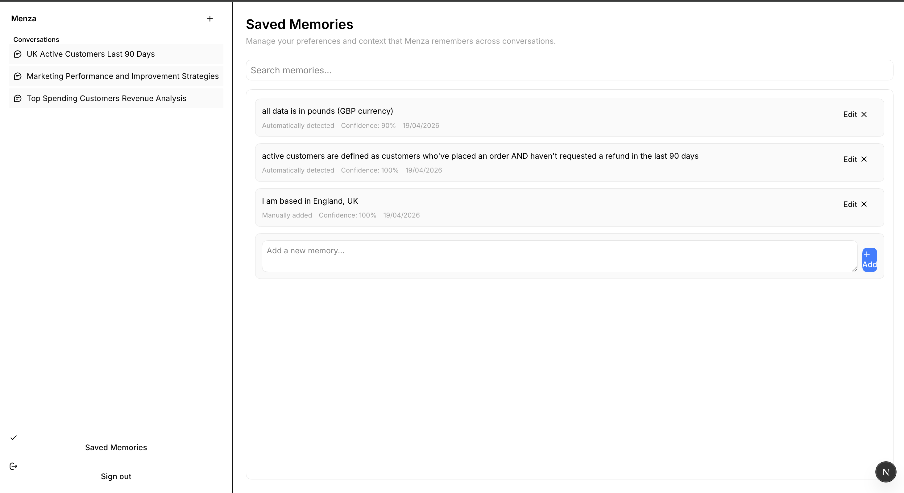

# Menza Take-Home: Persistent Memory for Business Context

## Problem
Menza users were repeating business-critical instructions in every conversation, for example:
- "Use GBP, not USD"
- "Active customers means ordered and no refund in the last 90 days"

## Goal
Build a practical memory system that:
1. Captures durable user preferences and business definitions.
2. Lets users review and edit memory explicitly.
3. Injects relevant memory into prompts so it affects future answers.
4. Keeps behavior correct in existing conversations (not only new chats).

## Solution Overview
I implemented a hybrid memory approach:
- **Automatic memory capture** from user messages (background job).
- **Manual memory CRUD UI** for user control.
- **Semantic retrieval** (embeddings + cosine similarity) to select relevant memories.
- **Token-capped prompt injection** to keep context bounded.
- **Context refresh per new user query** so existing conversations pick up memory changes.

## What I Implemented

### 1) Durable memory model
Added a dedicated memory schema with metadata and embeddings.

- Table: `user_memory`
- Fields include:
  - `content`
  - `embedding`
  - `metadata` (`confidence`, optional `category`, `source: automatic | manual`)

Why:
- Keeps memory explicit and queryable.
- Supports relevance ranking and future policy controls.

### 2) Automatic preference detection pipeline
After each user message, a worker job extracts durable preferences and stores them as memory.

Key characteristics:
- Asynchronous (non-blocking for chat UX)
- Confidence thresholding (`>= 0.7`) to reduce noisy memories
- Categorized extraction for future filtering/policy

Why:
- Captures intent from natural language without requiring users to configure settings manually.

### 3) Manual memory management screen
Built an inline memories UX with add/edit/delete and toast feedback.

Design choices:
- Inline interactions (not modal-heavy)
- Keyboard shortcuts for speed (`Enter`, `Escape`)
- Source visibility (`manual` vs `automatic`)

Why:
- Gives users direct control over assistant memory.
- Makes correction workflows fast and transparent.

UI note:
- In a fuller product with an existing Settings/Preferences entry point, I would place Saved Memories there rather than as a standalone section. For this take-home, a dedicated section improved discoverability and testability.

### Frontend constraints I encountered
I hit pre-existing frontend issues that were not introduced by this work. Given the timebox, I prioritized memory correctness over debugging unrelated UI infrastructure.

Specifically, dialogs (delete, edit, add) rendered near the bottom and dismissed immediately on click, indicating an existing modal positioning/dismiss wiring problem.

I also intentionally reused existing UI components to maintain style consistency and avoid spending disproportionate effort on polish, which meant inheriting existing layout quirks.

If those frontend issues were not present, I would have shipped two additional UI improvements:
1. A delete confirmation popup before removing a memory, to reduce accidental destructive actions.
2. A notification positioning fix for edit/save feedback (currently appearing at the bottom in some cases).

### 4) Correctness fix: edited automatic memory becomes manual
When a user edits an automatically detected memory, it now becomes manual.

Behavior:
- Preserve other metadata where useful (`confidence`, `category`)
- Force `source = manual` on user edit

Why:
- User edits are explicit intent and should have higher trust than inferred memory.

### 5) Existing-conversation freshness fix
Originally, memory context could become stale inside ongoing chats.

Fix:
- Use a managed hidden system context message for memory + data source context.
- Refresh/upsert that managed context for each new user query run.

Result:
- If a user adds/edits/deletes memory, subsequent queries in the same chat use the updated memory.

## Retrieval and Prompt Policy
Current memory injection policy:
1. Retrieve candidate memories via embedding similarity.
2. Filter low similarity memories.
3. Format for prompt under a memory context token cap (~500-token budget).

This balances relevance with prompt size while staying simple for this scope.

## Tradeoffs and Decisions

### Chosen now
- Prioritize **correctness and trust** first (memory persistence, editability, fresh reuse in existing chats).
- Add low-risk performance win (zero-memory short-circuit).

### Deferred on purpose
- Query-similarity cache with stored query embeddings + trigger-based invalidation.
- More advanced cache invalidation layer.

Reason:
- Higher complexity and operational overhead.
- Better to add after observing real latency and hit-rate telemetry.

## Why this solves the user complaint
Users no longer need to repeatedly restate stable context because:
- Context is extracted and persisted.
- Users can inspect and correct memory.
- Corrected memory is honored as manual intent.
- Updated memory is applied in subsequent messages, even in existing conversations.

## Future Additions
These are the next high-leverage improvements:

### 1) Org-aware memory policy
- Strengthen/validate retrieval boundaries for multi-tenant behavior.
- Add configurable precedence when both org-level defaults and user-level overrides exist.
  - Validate desired precedence with customers and product stakeholders.

### 2) Smarter retrieval skip logic
- If all memories together are below the token cap, bypass semantic ranking and include all.
- Avoid paying retrieval overhead when ranking would not change output.

### 3) Query-similarity cache (phase 2)
- Cache last query embedding + selected memory context.
- Reuse when memory version unchanged and query similarity is above threshold.
- Prefer versioned invalidation over fragile time-based assumptions.

### 4) Better observability
- Track memory retrieval latency, token footprint, and cache hit/miss metrics.
- Add logs that show when memory context was refreshed or skipped.

### 5) Evaluation and tests
- Add scenario tests for:
  - currency preference persistence (GBP vs USD)
  - business definition persistence (active customers definition)
  - edit/delete behavior in existing conversations
- Add regression tests for memory source transitions and tenant boundaries.

## Summary
This implementation introduces a practical memory architecture that improves user trust and consistency without overengineering:
- Durable memory storage
- Automatic extraction + manual control
- Relevance-based prompt injection with token budget
- Correct behavior in existing conversations
- Early, safe performance optimization

It is designed to evolve toward richer caching and enterprise-grade policy controls as usage grows.

Note: steps.md is a running todo list from weekend implementation sessions. There is also an initial-attempt branch where I explored a non-embedding approach before resetting and rebuilding this final version.
